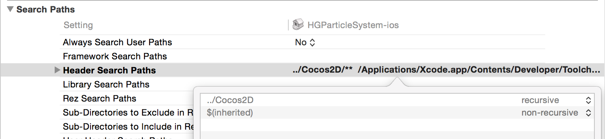

## HGParticleSystem

A project implementing particle systems based on [Cocos2d-SpriteBuilder](http://cocos2d.spritebuilder.com/). Intended for use with particle systems created in [Particle Editor](http://neobia.com/particleeditor/).

### Installation

Clone the project or download the [latest release](https://github.com/memega/HGParticleSystem/archive/v1.4.zip) from GitHub, or add it as a git submodule: `git submodule add https://github.com/memega/HGParticleSystem`.

Then, embed the library:

1. Drag a project into Xcode workspace, adding it as a subproject (either HGParticleSystem-ios.xcodeproj or HGParticleSystem-osx.xcodeproj depending on the platform).
2. Add a **Header Search Path** directing to HGParticleSystem in your project **Build Settings**.
3. Add `libHGParticleSystem-ios.a` or `libHGParticleSystem-osx.a` in **Link Binary With Libraries** section of your project **Build Phases**.
4. HGParticleSystem requires external cocos2d headers, so make sure to add a **Header Search Path** directing to cocos2d in the selected HGParticleSystem project **Build Settings**, like so:


### Usage

1. Create some `.hgps` files in [Particle Editor](http://neobia.com/particleeditor/), or download examples after following [the link](http://neobia.com/particleeditor/#effects).
2. Load `.hgps` files into in-memory cache. The cache prepopulates a number of particle system instances, available for immediate use.
3. Get an available instance of the particle system from the cache and add it as a child to a node. By default, the particle system will be automatically removed from parent after it finishes playing (see `autoRemoveOnFinish` property) and returned to the cache for reuse.

```obj-c
#import "HGParticleSystemCache.h"
#import "HGParticleSystem.h"

// add particle system to the cache
[[HGParticleSystemCache sharedCache] addParticleSystemFromFile:@"explosion.hgps"];
// get an available particle system
HGParticleSystem *system = [[HGParticleSystemCache sharedCache] particleSystemForKey:@"explosion.hgps"];
// returned system might be nil
if (system)
{
    [self addChild:system];
}
```

### Configuration

`HGParticleSystem` also permits programmatic creation and configuration. All property values editable in [Particle Editor](http://neobia.com/particleeditor/) can be changed in code.

```obj-c
HGParticleSystem *system = [[HGParticleSystem alloc] initWithMaxParticles:256];
[system setTexture:image withRect:(CGRect){CGPointZero, texture.contentSizeInPixels}];
[system setValue:@YES forKey:HGLoopingPropertyKey];
[system setPropertyWithConstant:@10 forKey:HGStartSizePropertyKey];
```

Most properties are of dynamic nature and therefore they should only be set with designated `-setProperty:forKey:` method or similar convenience setters. Some properties as simple values and should be set with `-setValue:forKey` methods.

Please refer to `HGParticleSystem.h` for more information on available property keys and their specifics.

### Limitations

Apple's Metal graphics API rendering is not supported.

### License

This project is licensed under the terms of the [MIT license](http://memega.mit-license.org/).
